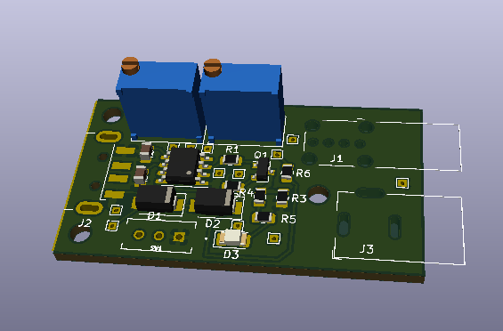

# PowerBankLoad

This device prevents my power bank from sleep when I am trying to power my DIY devices that draw less than 150 mA of power.

It is inspired by the blog post [Battery Pack Load](https://dorkbotpdx.org/blog/paul/battery_pack_load/) by Paul.

I changed a schematic, so it uses 555 timer to generate pulses instead of two bipolar transistors.
Well,  you may say that it is an overkill, however, I feel more comfortable with timer than with two transistors I need to adjust.
As a bonus, device supports adjusting pulse width and frequency.

## 3D View

